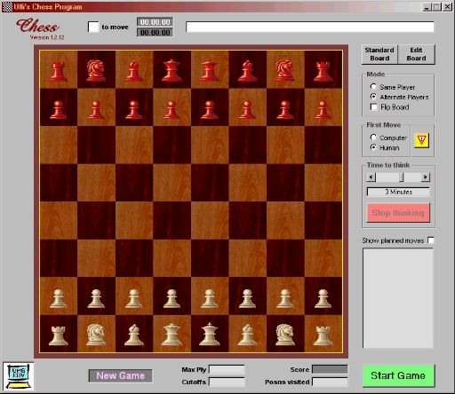



## Ulli's Chess Playing Program

### Description

This is my attempt to make a chess program. The AI still needs a lot of cooking but the UI is done and it knows most rules (read the attached F.I.D.E. Laws Of Chess). Don't try yet to play against the computer - you will win :-) or worse - the program may crash. I myself am a below-average chess player, so I cannot say anything about the program's strenght or style of play. Time limit does not work properly, so give it say 6 or 12 seconds thinking time, more will make you wait virtually forever... Problem solving works though, I think.

Unfortunately PSC does not let me upload Gradient.OCX or MsgHook.OCX, so you will have to delete all references to them. Also the TTF Amaze is not uploadable, just substitute another nice looking font for it.

The piece images were copied from RJSoft's Chess Program, with his permission. Enjoy.
 
### More Info
 

             |
---                |---
**Submitted On**   |2002-01-22 08:43:14
**By**             |[ULLI](https://github.com/Planet-Source-Code/PSCIndex/blob/master/ByAuthor/ulli.md)
**Level**          |Advanced
**User Rating**    |4.9 (79 globes from 16 users)
**Compatibility**  |VB 5\.0, VB 6\.0
**Category**       |[Games](https://github.com/Planet-Source-Code/PSCIndex/blob/master/ByCategory/games__1-38.md)
**World**          |[Visual Basic](https://github.com/Planet-Source-Code/PSCIndex/blob/master/ByWorld/visual-basic.md)
**Archive File**   |[Ulli's\_Che503621222002\.zip](https://github.com/Planet-Source-Code/ulli-ulli-s-chess-playing-program__1-31064/archive/master.zip)

